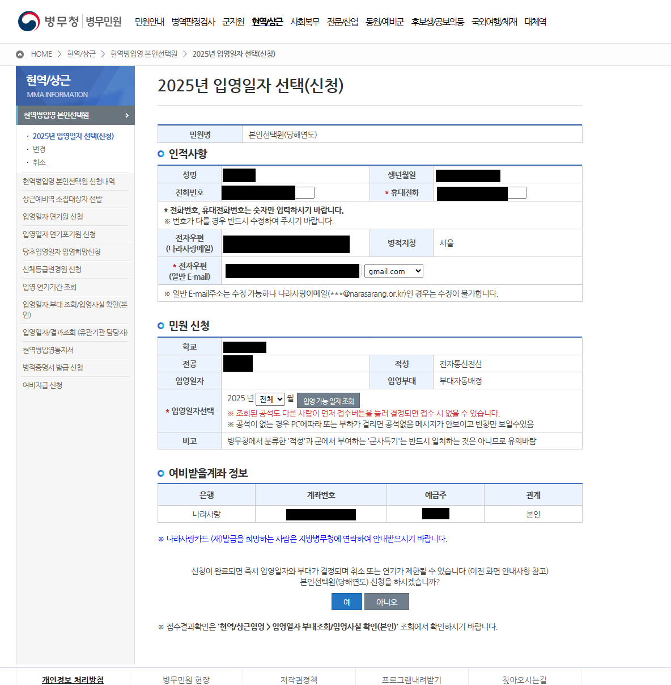

# 입영 신청 자동화 프로그램 사용법

이 프로그램은 **Windows(윈도우) 환경**에서만 정상적으로 동작합니다.

> **Tip:**  
> 작업은 [VSCode](https://code.visualstudio.com/)와 같은 IDE(통합 개발 환경)에서 진행하는 것을 권장합니다.  
> 명령어 입력, 파일 편집, 경로 이동 등이 훨씬 편리합니다.

아래 순서대로 따라 하시면 됩니다.

---

## 1. Python 3.11 설치하기 (Windows 전용)

이 프로그램은 **Python 3.11** 버전이 반드시 필요합니다.  
아래 링크에서 Python 3.11을 다운로드하여 설치하세요.

- [Python 3.11 다운로드(공식 사이트)](https://www.python.org/downloads/release/python-3110/)

**설치 방법**

1. 위 링크를 클릭하여 설치 파일을 다운로드합니다.
2. 설치 파일을 실행합니다.
3. 설치 화면에서 **"Add Python 3.11 to PATH"**(또는 "Add Python to PATH")에 체크한 뒤,  
   **"Install Now"**를 클릭하여 설치를 완료합니다.

> **중요:**  
> 이미 다른 버전의 Python(예: 3.10, 3.9 등)이 설치되어 있다면,  
> 반드시 3.11 버전이 설치되어 있는지 확인하세요.
>
> 명령 프롬프트(또는 터미널)에서 아래 명령어로 버전을 확인할 수 있습니다.
>
> ```
> python --version
> ```
>
> 만약 `Python 3.11.x`가 아니라면,  
> 아래와 같이 입력해보세요.
>
> ```
> py -3.11 --version
> ```
>
> 이후 모든 명령어에서 `python` 대신 `py -3.11`을 사용하면 됩니다.  
> (예: `py -3.11 -m venv .venv`)

---

## 2. 명령 프롬프트(터미널) 열기

아래 방법 중 하나를 선택하세요.

- **명령 프롬프트(cmd) 또는 PowerShell**

  - 윈도우 키 + R → `cmd` 또는 `powershell` 입력 후 Enter

- **Git Bash (권장)**
  - [Git for Windows](https://gitforwindows.org/)를 설치한 후,  
    바탕화면이나 폴더에서 마우스 우클릭 → "Git Bash Here" 선택

> **Tip:**  
> Git Bash를 사용하는 것이 경로 문제 등에서 더 편리하므로 **Git Bash 사용을 권장**합니다.

---

## 3. 프로그램 폴더로 이동하기

명령 프롬프트/터미널에서 아래 명령어를 입력하고 Enter를 누르세요.  
(아래 경로는 예시입니다. 실제로 프로그램이 있는 폴더 경로로 이동해야 합니다.)

```
cd C:/Users/ZARATHU11/yookgoon
```

---

## 4. 가상환경(venv) 만들기

아래 명령어를 입력하고 Enter를 누르세요.

- Python 3.11이 기본 python 명령어로 등록된 경우:
  ```
  python -m venv .venv
  ```
- Python 3.11이 `py -3.11`로만 실행되는 경우:
  ```
  py -3.11 -m venv .venv
  ```

---

## 5. 가상환경 활성화하기 (Git Bash 권장, PowerShell도 가능)

### ● Git Bash에서 (권장)

아래 명령어를 입력하고 Enter를 누르세요.

```
source .venv/Scripts/activate
```

> 활성화되면 프롬프트 앞에 `(venv)`가 표시됩니다.

### ● PowerShell에서

아래 명령어를 입력하고 Enter를 누르세요.

```
.venv\Scripts\Activate.ps1
```

> 만약 실행 권한 오류가 발생하면,  
> PowerShell을 관리자 권한으로 실행한 뒤 아래 명령어를 먼저 입력하세요.
>
> ```
> Set-ExecutionPolicy -ExecutionPolicy RemoteSigned -Scope CurrentUser
> ```

---

## 6. 필수 패키지 설치하기

아래 명령어를 입력하고 Enter를 누르세요.

```
pip install -r requirements.txt
```

---

## 7. Chrome 디버깅 모드 실행하기

1. 윈도우 키 + R을 누릅니다.
2. "실행" 창에 아래 명령어를 복사해서 붙여넣고 Enter를 누르세요.

```
C:\Program Files\Google\Chrome\Application\chrome.exe --remote-debugging-port=9222 --user-data-dir="C:/ChromeTEMP"
```

> 만약 위 경로에 Chrome이 없다면, 크롬이 설치된 경로를 확인해서 입력하세요.

---

## 8. 매크로 실행하기

먼저 아래 명령어를 입력하여 **매크로를 실행해둡니다**.

```
python mma.py
```

> Python 3.11이 `py -3.11`로만 실행되는 경우:
>
> ```
> py -3.11 mma.py
> ```

---

아래 이미지는 **크롬 디버깅 모드로 접속해야 하는 페이지**의 예시입니다.



1. 위와 같은 페이지에서 **"입영 가능 일자 조회"** 버튼을 누르는 순간,  
   실행 중이던 매크로가 자동으로 동작합니다.
2. 매크로 실행 완료 후 해당 페이지에 **alert(알림) 창**이 뜨면,  
   "예" 버튼을 직접 **엔터(Enter)** 키로 눌러주면 정상적으로 완료됩니다.

---

## 자주 묻는 질문(FAQ)

- **Q. Python이 설치되어 있는지 어떻게 확인하나요?**  
  명령 프롬프트/터미널에 `python --version` 또는 `py -3.11 --version`을 입력하고 Enter를 누르세요.  
  `Python 3.11.x`와 같이 나오면 정상입니다.

- **Q. pip 명령어가 안 될 때**  
  `python -m pip install --upgrade pip` 또는  
  `py -3.11 -m pip install --upgrade pip` 명령어를 먼저 실행해보세요.

- **Q. 가상환경 활성화가 안 될 때**  
  Git Bash, PowerShell 등 터미널 종류에 따라 명령어가 다르니 위 안내를 참고하세요.
